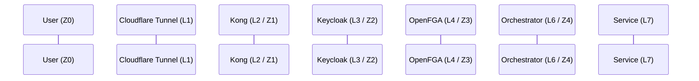
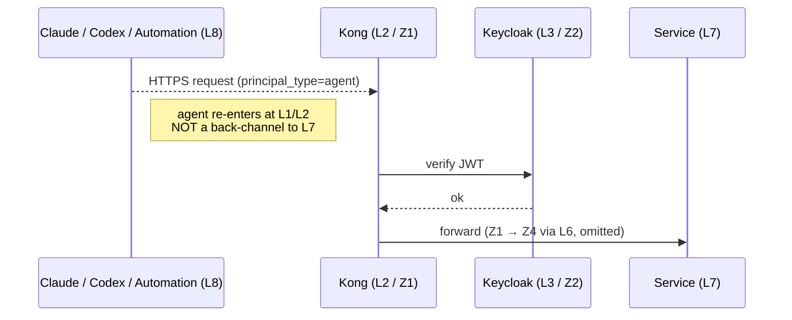
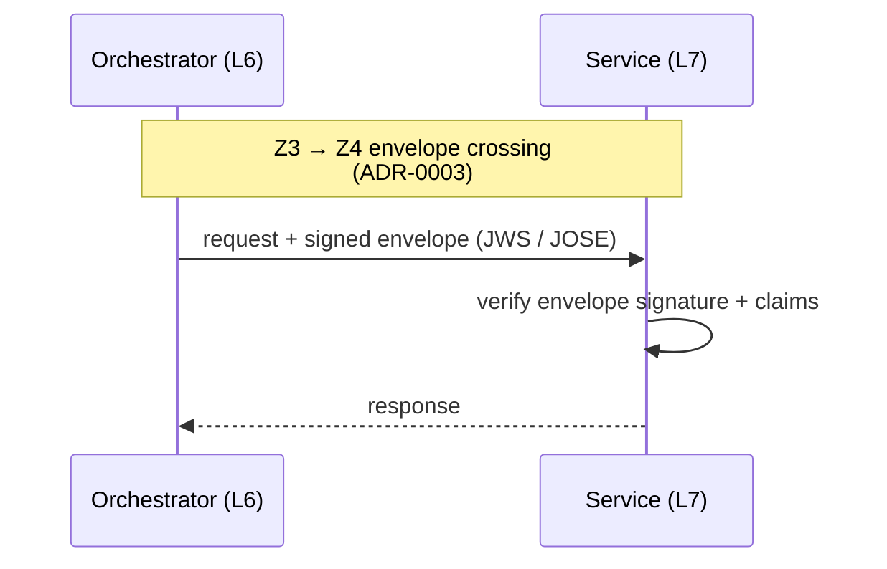
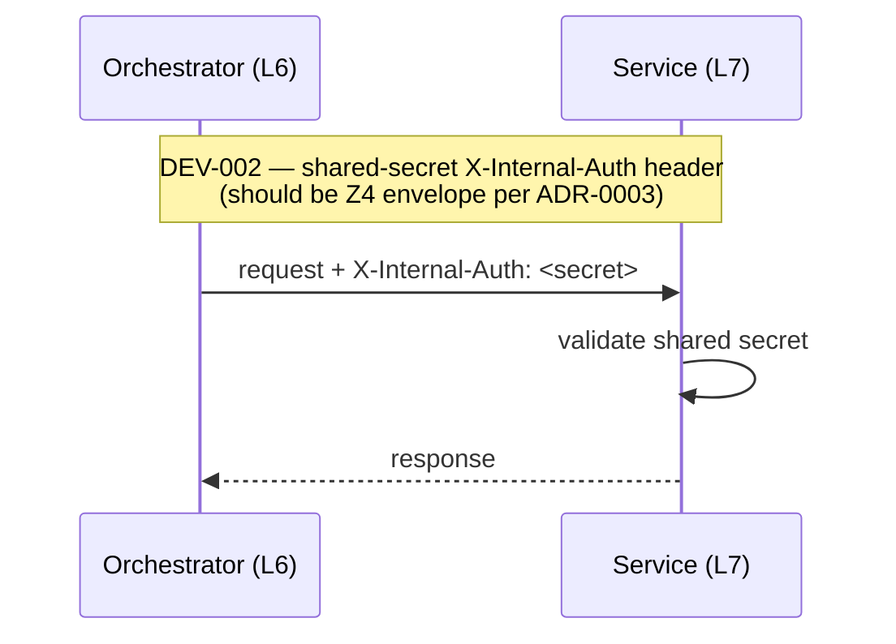
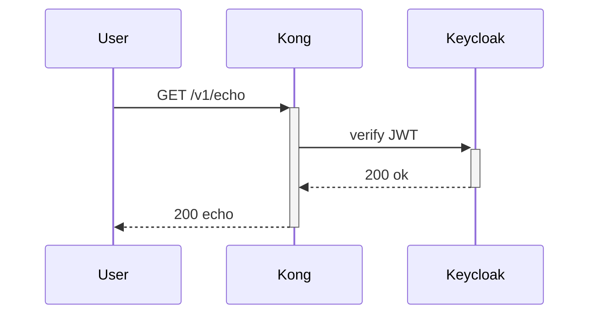
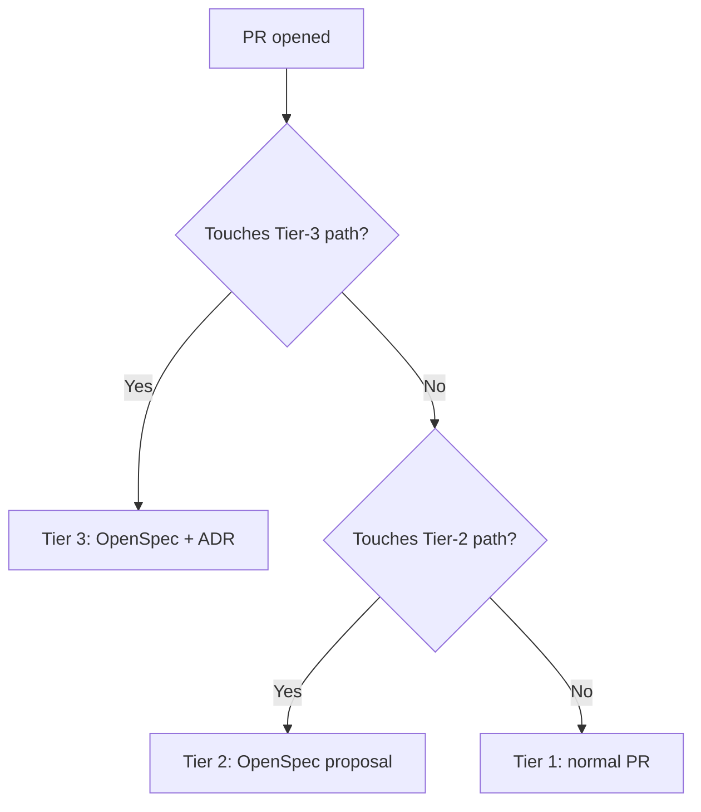

# Mermaid: workspace architecture vocabulary

Apply this when the Mermaid diagram depicts a concept from this workspace's visual vocabulary (trust zones, layer interactions, agents-as-clients, envelope crossings, deviation callouts). The source-of-truth for the vocabulary is [`../../../../standards/diagramming-conventions.md`](../../../../standards/diagramming-conventions.md); this file translates it into Mermaid-specific patterns.

---

## Trust-zone notation in participants

Annotate each participant with its trust zone in parentheses. This is the single most useful convention — it makes the trust-crossing structure visible without colour (Mermaid does not honour custom zone fills the way drawio does).

Read the participants left-to-right and you see the zone progression `Z0 → Z1 → Z2 → Z3 → Z4`.

---

## Layer-to-zone mapping (cheat sheet)

When labelling a participant, the zone is what the participant produces AFTER its check runs, not what it operates in:

| Layer | Operates in | Produces (zone of subsequent traffic) |
|---|---|---|
| L1 Network reachability | Z0 / public | Z0 — admission only, no zone change |
| L2 Edge gateway | Z0 → Z1 | Z1 — perimeter crossed, TLS terminated |
| L3 Identity | Z1 | Z2 — authenticated identity verified |
| L4 Authorization | Z2 | Z3 — decision recorded |
| L5 Operational guardrails | Z3 | Z3 (no zone change — gating only) |
| L6 Orchestrator / BFF | Z3 → Z4 | Z4 — envelope issued |
| L7 Service enforcement | Z4 | Z4 (verifies envelope every hop) |
| L8 Semantic / agent | Re-enters at L1/L2 as a client | n/a — not in the request path; uses the same chain |

In participant labels, write the layer the participant *is*, and the zone of the traffic *leaving* it. So Kong is `Kong (L2 / Z1)`; the request *arriving at* Kong is Z0, but the traffic *leaving* Kong is Z1.

---

## Agent-as-client lane

Per [ADR-0002](../../../../docs/decisions/ADR-0002-agents-are-clients-not-insiders.md), agents traverse the same chain as users — no back-channel. In Mermaid, depict this with a dashed line connecting the agent back to L1/L2 so it visually obvious:

The `-->>` (dashed arrow) on the first message reinforces "this is an agent traversing the public path" visually.

---

## Envelope crossing (Z3 → Z4)

The L6→L7 envelope handoff is the most security-critical seam. In sequence diagrams, mark it explicitly with a `note` and a labelled message:

The `Note over` annotation cites the ADR; the message label spells out the envelope mechanism. Both are required if the diagram includes this seam.

---

## Deviation callouts

When the diagram depicts a consumer's deviation from the reference architecture (e.g., `DEV-002` shared-secret instead of envelope), call it out with a `Note over` annotation referencing the deviation ID. The full reason + compensating control stay in `security-first-adoption.md`, not on the diagram.

The deviation ID `DEV-002` matches the entry in trupryce's `security-first-adoption.md` `deviations:` list.

---

## Activation bars for in-flight requests

Use `+` and `-` on the message arrow to draw activation bars (the vertical rectangles that show when a participant is "busy"):

This is optional but makes the per-participant work boundaries clear when reading a complex sequence.

---

## Flowchart variants for OpenSpec / lifecycle diagrams

When diagramming the OpenSpec tier triage or dependency-record lifecycle, use `flowchart` with shape vocabulary matching the model:

Diamond shapes (`{...}`) are decisions; square shapes (`[...]`) are outcomes; arrows have labels for the decision branches.

---

## Anti-patterns

- **Inventing your own zone colours via `linkStyle` / `classDef`.** Mermaid colours diverge from drawio's vocabulary, and consumers reading both will get confused. Stick to the `(Zn)` annotation in participant labels.
- **Depicting agents on a direct path to L7.** ADR-0002 forbids it. If the sequence requires an agent reaching a service, route it through Kong, even if that adds participants. A diagram that shows otherwise is the bug.
- **Omitting the envelope citation on Z3→Z4 messages.** The L6→L7 crossing is the most reviewable security boundary in the system. Every diagram that depicts it must cite ADR-0003.
