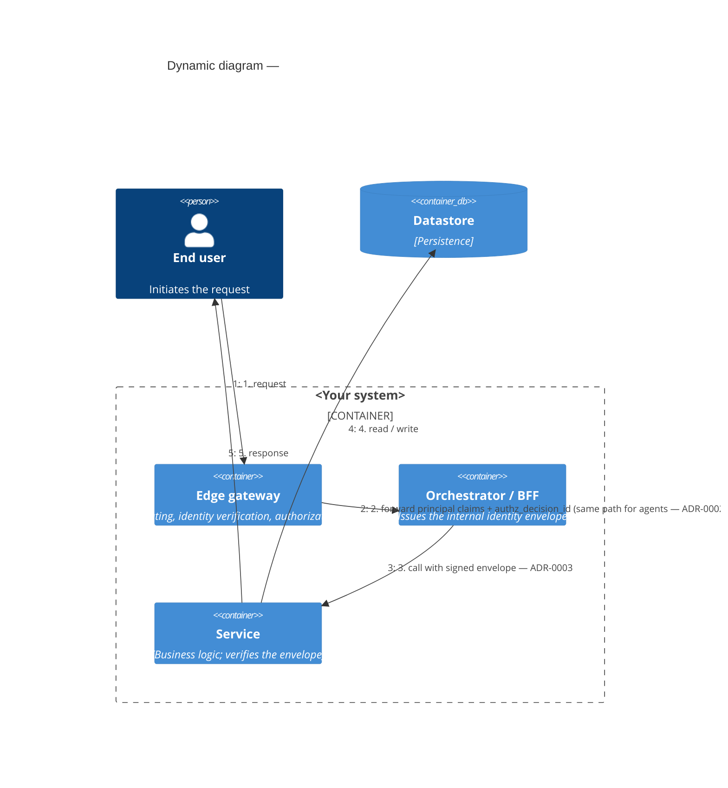

# Template — C4 Dynamic

**Archetype:** C4 Dynamic (Mermaid `C4Dynamic`) — answers *"What is the message order for a specific scenario, in C4 vocabulary?"*

## How to use

1. Copy to `docs/diagrams/<name>-c4-dynamic.md` or `architecture/diagrams/<name>-c4-dynamic.md`.
2. Replace the people, containers, and relationships with your scenario.
3. **No trust-zone notation in the visual** — that is the anti-mixing rule (`standards/diagramming-conventions.md` §Anti-patterns). C4 answers the container/message question; the [trust-zone sequence template](trust-zone-sequence.md) answers the security-boundary question. Keep them in separate diagrams.
4. Cite ADRs by ID in the relationship labels where a relationship is governed by one (e.g. `ADR-0002` agents-as-clients, `ADR-0003` envelope).
5. Numbered order comes from the `Rel` order; Mermaid renders the sequence index automatically.

## Diagram

**Source of truth:** _cite the scenario's governing docs/ADRs._
**Last reviewed:** `YYYY-MM-DD` by `@handle` · **Next review:** `YYYY-MM-DD` (+90 days). Add the row to your `diagrams/INDEX.md`.

> Reference: [c4model.com](https://c4model.com/) · [Mermaid C4 syntax](https://mermaid.js.org/syntax/c4.html). Mermaid's C4 support is experimental; if a renderer chokes on `C4Dynamic`, the [drawio C4 Container template](c4-l2-container.drawio) plus numbered relationship labels is the fallback.
