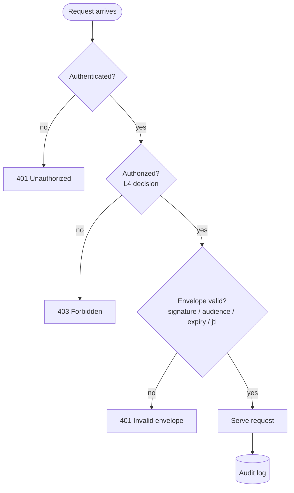
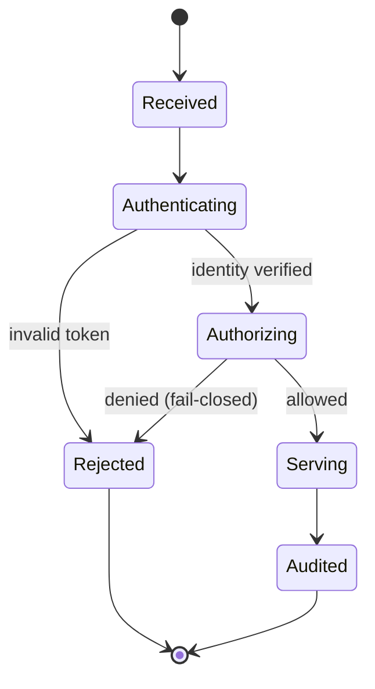

# Template — Decision tree / state machine

**Archetype:** Decision tree / state machine (Mermaid `flowchart` / `stateDiagram-v2`) — answers *"What state transitions are possible? What decisions branch where?"*

## How to use

1. Copy to `docs/diagrams/<name>.md` or `architecture/diagrams/<name>.md`.
2. Pick the form that fits:
   - **`flowchart`** for a decision tree (branch on conditions) — the first block below.
   - **`stateDiagram-v2`** for a state machine (named states + transitions) — the second block below; delete whichever you do not use.
3. No trust-zone colours needed for this archetype (`standards/diagramming-conventions.md` §Diagram archetypes). If a decision is security-relevant, name the control layer in the node text (e.g. "L4 decision").

## Decision tree (`flowchart`)

## State machine (`stateDiagram-v2`)

**Source of truth:** _cite the runbook / ADR / control-layer doc this logic comes from._
**Last reviewed:** `YYYY-MM-DD` by `@handle` · **Next review:** `YYYY-MM-DD` (+90 days). Add the row to your `diagrams/INDEX.md`.
