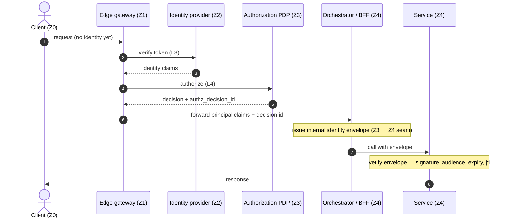

# Template — Trust-zone sequence

**Archetype:** Trust-zone sequence (Mermaid `sequenceDiagram`) — answers *"How does a request traverse the security boundaries, with timing?"*

## How to use

1. Copy to `docs/diagrams/<name>-sequence.md` (consuming repo) or `architecture/diagrams/<name>-sequence.md`.
2. Replace each participant and message with your scenario.
3. **Keep the `(Zn)` trust-zone tag in every participant label** — that is the signature security-first notation (see the `mermaid-diagram` skill's [`architecture-vocab.md`](../../../.agents/skills/mermaid-diagram/references/architecture-vocab.md) §Trust-zone notation).
4. Do **not** mix C4 vocabulary into this diagram — one archetype per diagram (anti-mixing rule, `standards/diagramming-conventions.md` §Anti-patterns). If you need the C4 message order, use the [C4 Dynamic template](c4-dynamic.md) instead.
5. Fill in the **Source of truth** line below the diagram and the review dates.

## Diagram

**Source of truth:** _cite the doc(s) this sequence realises — e.g._ `architecture/control-layers.md`, `architecture/security-boundaries.md`, `ADR-0003`.
**Last reviewed:** `YYYY-MM-DD` by `@handle` · **Next review:** `YYYY-MM-DD` (+90 days). Add the row to your `diagrams/INDEX.md`.
